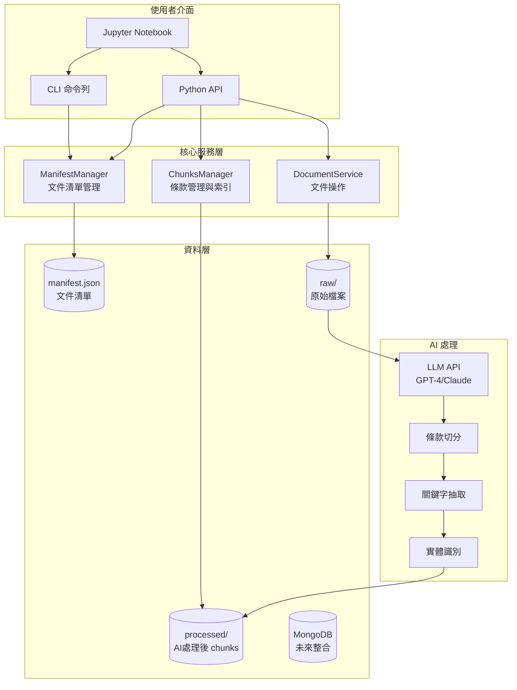
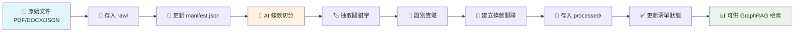
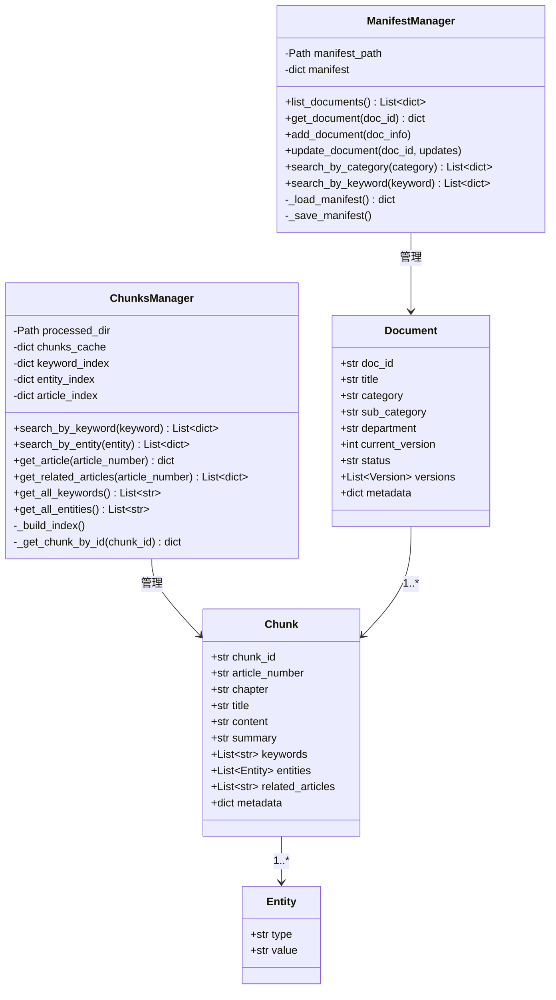
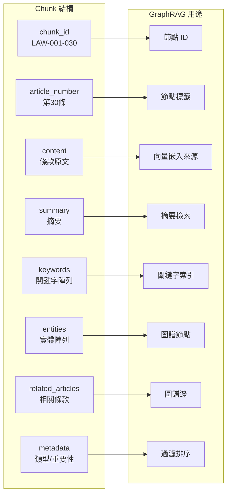
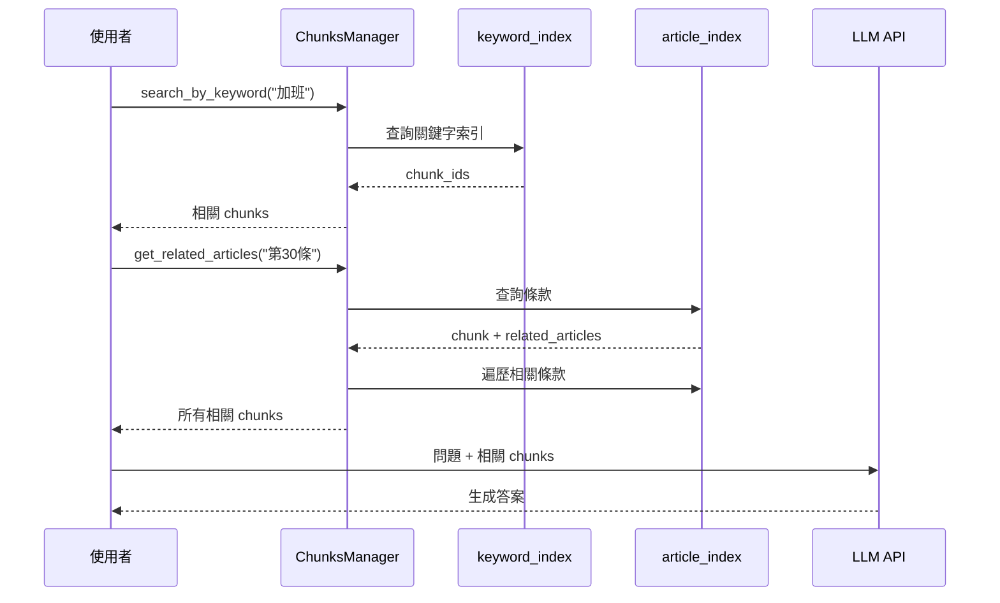
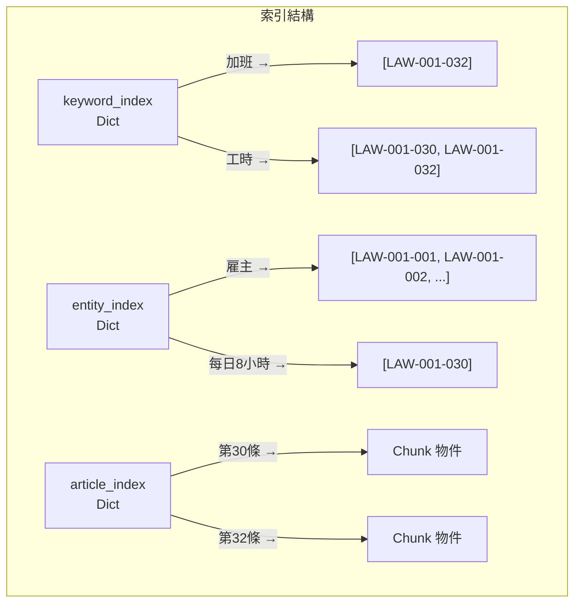
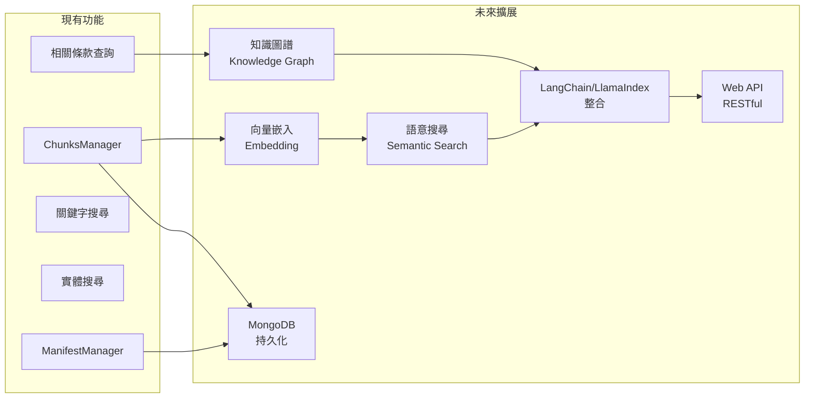

# 🏗️ 系統架構文件

本文件說明 KM 文件管理系統的整體架構、類別設計、資料流程。

---

## 1. 系統整體架構



---

## 2. 資料處理流程



---

## 3. 類別圖 (UML Class Diagram)



---

## 4. 資料結構

### Document 結構

| 欄位 | 型別 | 說明 |
|------|------|------|
| `doc_id` | string | 文件唯一識別碼，如 LAW-001 |
| `title` | string | 文件標題 |
| `category` | string | 分類（法規、人力資源等） |
| `sub_category` | string | 子分類 |
| `department` | string | 所屬部門 |
| `current_version` | int | 當前版本號 |
| `status` | string | 狀態：active / archived |
| `versions` | array | 版本歷史陣列 |
| `metadata` | object | 關鍵字、生效日期等 |

### Chunk 結構（GraphRAG 格式）



| 欄位 | 型別 | 說明 | GraphRAG 用途 |
|------|------|------|---------------|
| `chunk_id` | string | 唯一識別碼 | 節點 ID |
| `article_number` | string | 條款編號 | 節點標籤 |
| `chapter` | string | 所屬章節 | 分類 |
| `title` | string | 條款標題 | 顯示用 |
| `content` | string | 條款原文 | 向量嵌入來源 |
| `summary` | string | 摘要 | 快速檢索 |
| `keywords` | array | 關鍵字陣列 | 關鍵字索引 |
| `entities` | array | 實體陣列 | 圖譜節點 |
| `related_articles` | array | 相關條款 | 圖譜邊（關聯） |
| `metadata` | object | 類型、重要性 | 過濾與排序 |

---

## 5. GraphRAG 查詢流程



---

## 6. 索引結構

ChunksManager 建立三種索引，加速查詢：



| 索引名稱 | 結構 | 說明 |
|----------|------|------|
| `keyword_index` | `keyword → [chunk_ids]` | 關鍵字到 chunks 的映射 |
| `entity_index` | `entity → [chunk_ids]` | 實體到 chunks 的映射 |
| `article_index` | `article_number → chunk` | 條款編號到 chunk 的直接映射 |

---

## 7. 檔案結構

```
ai-asst-db/
├── data/
│   ├── manifest.json              # 文件清單主索引
│   ├── raw/                       # 原始檔案
│   │   └── 勞動基準法.json
│   └── processed/                 # AI 處理後的 chunks
│       └── 勞動基準法_chunks.json
├── notebooks/
│   ├── tutorial.ipynb             # 基礎教學
│   └── document_workflow.ipynb    # 工作流程實作
├── scripts/
│   ├── init_db.py                 # 資料庫初始化
│   └── import_labor_law.py        # 匯入腳本
├── config/
│   └── settings.py                # 系統設定
├── db/
│   └── connection.py              # MongoDB 連線
├── models/
│   └── document.py                # 資料模型
├── services/
│   └── document_service.py        # 文件服務
└── cli.py                         # 命令列介面
```

---

## 8. 未來擴展



| 優先順序 | 功能 | 說明 |
|----------|------|------|
| 1 | 向量嵌入 | 使用 OpenAI/Sentence-Transformers 生成 embedding |
| 2 | 語意搜尋 | 基於向量相似度的搜尋 |
| 3 | MongoDB 整合 | 將 JSON 資料遷移至 MongoDB |
| 4 | 知識圖譜 | 使用 Neo4j 建立完整的知識圖譜 |
| 5 | LangChain 整合 | 結合 LLM 建立完整 RAG 系統 |
| 6 | Web API | 提供 RESTful API 供前端使用 |
